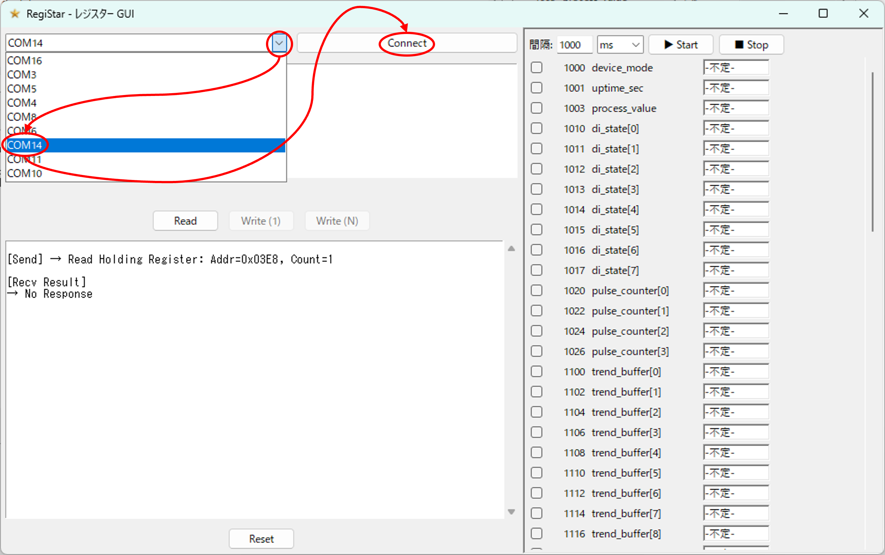
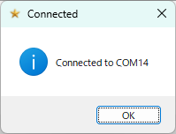
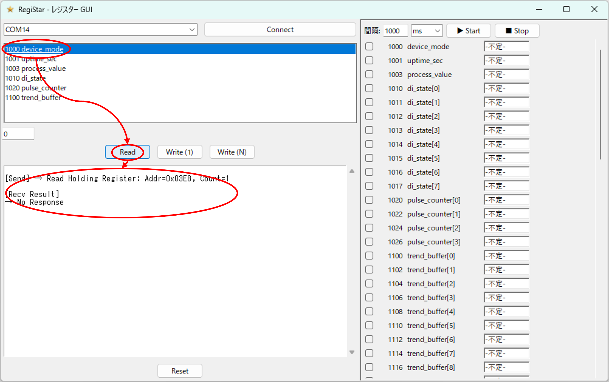
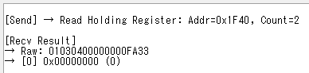
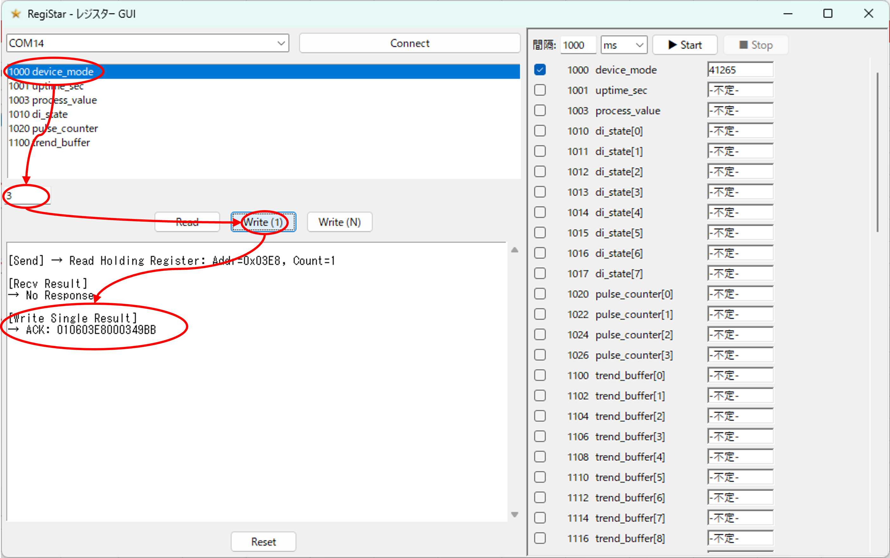
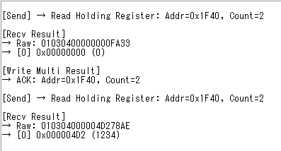
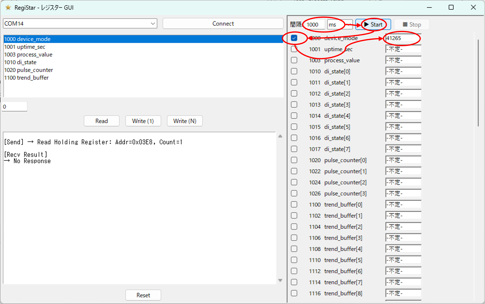
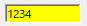
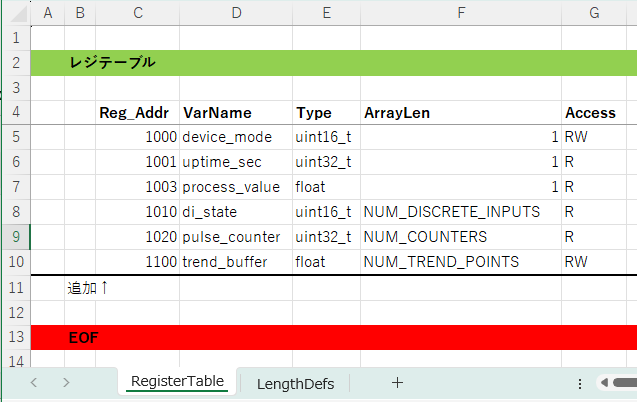
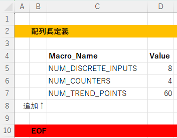

# RegiStar Modbus Master Simulator

Modbus レジスタの読み書きを GUI でテストできるシンプルなシミュレーターです。
Excel で定義したレジスタテーブルを読み込み、直感的な操作で通信内容を確認できます。

## インストール

### EXE版を使う

#### ダウンロード
Windows 向けの実行ファイル（exe）は  
GitHub Releases ページからダウンロードできます。

➡ **[Releases ページはこちら](https://github.com/prevalmam/MODBUS_MASTER_SIM/releases)**

最新バージョンの Assets から  
`modbus-master-sim.exe` をダウンロードしてください。

#### SHA-256（検証用）

配布している実行ファイルの SHA-256 ハッシュ値は  
Releases の Assets に含まれる `SHA256SUMS.txt` に記載しています。

ダウンロード後、以下のコマンドで検証できます。
```powershell
certutil -hashfile modbus-master-sim.exe SHA256
```
出力されたハッシュ値が SHA256SUMS.txt に記載されている値と一致すれば、
ファイルが改ざんされていないことを確認できます。

### ソースコードから使う

#### git clone + pip install
次に示すコマンドを実行して，ソースコードをクローンし，pip でインストールします。

```powershell
git clone https://github.com/prevalmam/MODBUS_MASTER_SIM.git
cd MODBUS_MASTER_SIM
pip install .
```

#### 使い方

1. Excel でレジスタ定義ファイルを準備します。
2. コマンドラインから以下を実行します。

```powershell
registar
```

3. 起動後に Excel ファイルを選択すると GUI が表示されます。

### 接続手順



1. COM ポート欄の `▼` をクリックします。
2. 接続したいシリアルポートを一覧から選択します。
3. `Connect` ボタンを押して接続します。



接続に成功するとダイアログで通知され、以降はレジスタの読み書き操作が可能になります。

### 単発 Read の実行



1. `RegisterTable` から読みたい要素を選択します。
2. `Read` ボタンを押します。

結果は画面下部のログエリアに表示されます。サンプル画像では未接続レジスタを読み込んでいるため `No Response` となっていますが、正しく応答がある場合は数値が表示されます。



応答がある場合は上記のようにアドレス・生データ・整形済み値が順にログに残り、数値の確認が容易です。

### 単発 Write の実行



1. 書き込みたいレジスタ要素を選択します。
2. 入力欄に書き込みたい数値を入力します。
3. `Write (1)` ボタンを押します。（`Write (1)` は Modbus FC 0x06: *Preset Single Register*、複数値を書き込みたい場合は `Write (N)` を使用します。`Write (N)` は FC 0x10: *Preset Multiple Registers*）

結果はログエリアに表示されます。例では未接続先に対して書き込みを行っているため ACK のみが記録されています。



正しく応答がある環境では上記のように ACK の詳細と値の反映がログに残り、続く Read にも書き込んだ値が表示されます。

### periodic Read（自動ポーリング）



1. `間隔` フィールドでポーリング周期を数値と単位で指定します。
2. `▶ Start` ボタンを押してポーリングを開始します。
3. 右側リストで定期的に読みたいレジスタのチェックボックスをオンにします。

チェックされたレジスタは指定間隔で読み出され、結果がログエリアに追記されます。



値が更新された場合、該当のセル背景が黄色になり変化をすぐに確認できます。


通信途絶やエラーで値を取得できない場合は背景が赤色になり、異常を視覚的に把握できます。

### Excel フォーマット概要



- `RegisterTable` シート: `Reg_Addr` 見出し行の下に、アドレス、変数名、型、配列長、アクセス種別 (R/W/RW) を記載します。`EOF` 行がテーブル終端です。



- `LengthDefs` シート: 配列長をマクロ名で管理する場合、`EOF` 行まで `Macro` と `Value` の対応を並べます。`RegisterTable` の配列長列でマクロ名を参照できます。
- それ以外の列は不要で、テンプレートに従って入力すれば自動的に GUI に反映されます。
